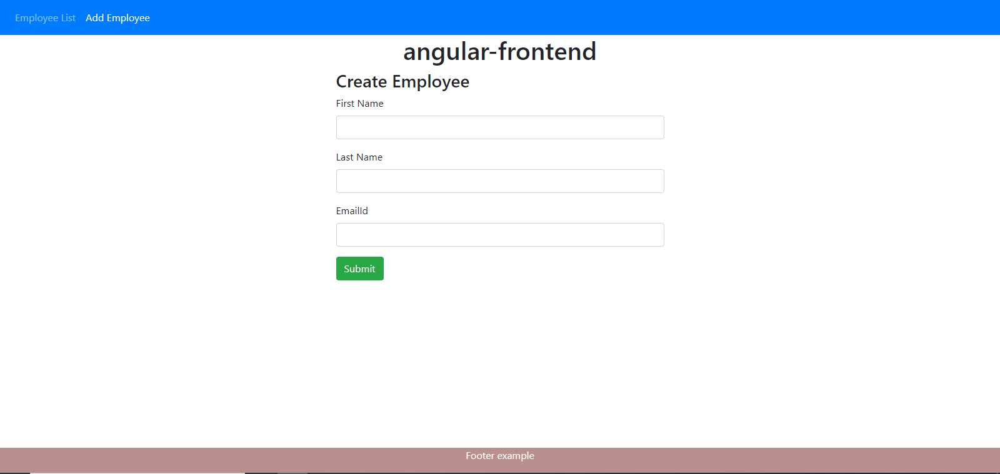
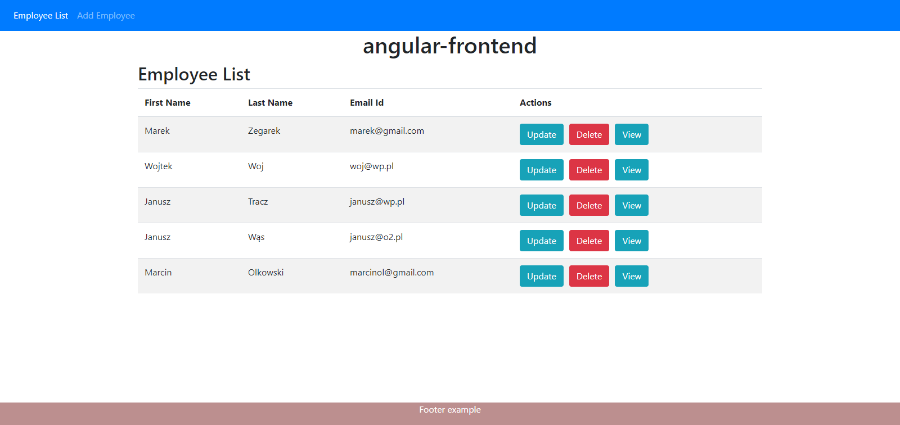
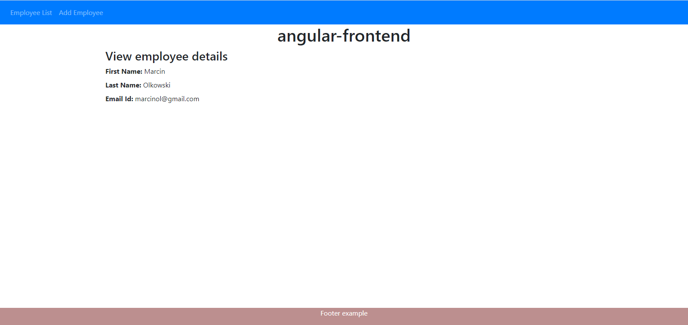
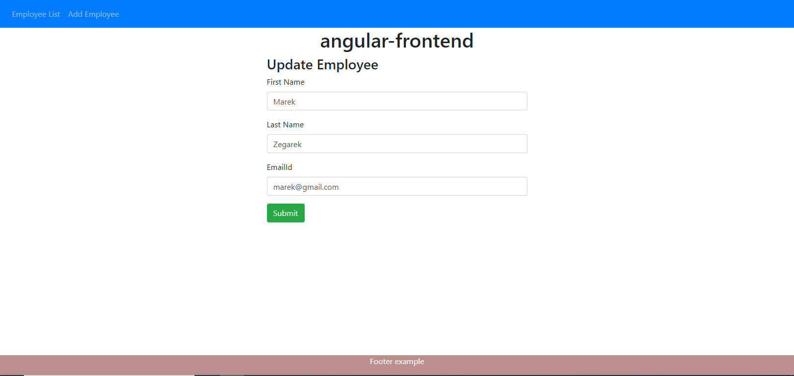
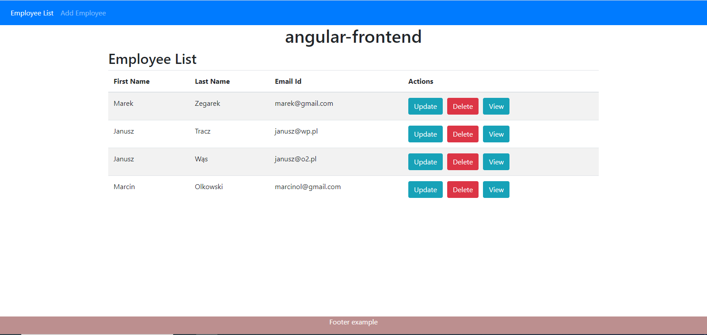

# Employee management application

The application consists of:

<b>List of all employees:
  

<b>Adding an employee:
  

<b>Checking the result after adding an employee:
  

<b>Personal data of each employee:
  

<b>Updating employee data:
  

<b>Removal of an employee:
  

<b>Database screen information:
  

